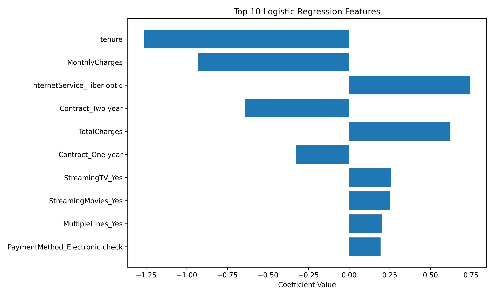
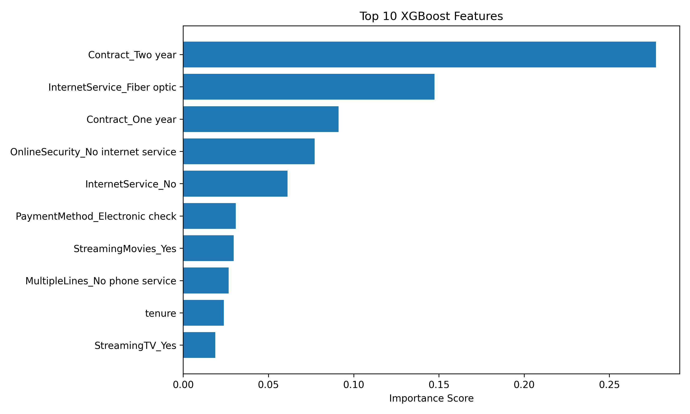

# Customer Churn Prediction

End-to-end machine learning project for predicting customer churn using Logistic Regression and XGBoost, with business-driven threshold tuning and feature importance analysis.

---

## 📊 Project Overview

Customer churn prediction is critical for subscription-based businesses.  
This project aims to identify customers who are likely to leave and provide actionable insights for retention strategies.

The project includes:

- Data preprocessing
- Handling class imbalance
- Logistic Regression (with threshold tuning)
- XGBoost model
- ROC-AUC comparison
- Confusion matrix analysis
- Feature importance interpretation
- Feature importance visualization

---

## 📁 Dataset

Telco Customer Churn Dataset  
Contains 7,000+ customers with 21 features including:

- Demographics
- Account information
- Services subscribed
- Billing details
- Contract type
- Payment method

Target variable:
- `Churn` (Yes / No)

---

## ⚙️ Models Used

### 1️⃣ Logistic Regression
- Class imbalance handled using `class_weight="balanced"`
- Business-driven threshold tuning (0.4)
- ROC-AUC: **0.83**
- High recall for churn detection (0.87)

### 2️⃣ XGBoost
- Imbalance handled with `scale_pos_weight`
- ROC-AUC: **0.82**
- More balanced overall performance

---

## 📈 Model Performance (Logistic Regression - Threshold 0.4)

- Recall (Churn): **0.87**
- Precision (Churn): 0.45
- ROC-AUC: 0.83

The model prioritizes identifying churn customers (high recall), which is critical in retention strategies.

---

## 🔍 Key Business Insights

Feature importance analysis revealed:

- Customers with short-term contracts are more likely to churn.
- Fiber optic internet users show higher churn probability.
- Customers paying via electronic check are at higher risk.
- Long-tenure customers are significantly less likely to churn.

### Business Recommendation:
Encourage long-term contracts and automatic payment methods to reduce churn.

---

## 📊 Feature Importance Visualizations

### Logistic Regression


### XGBoost


---

## 🛠 Technologies Used

- Python
- Pandas
- NumPy
- Scikit-learn
- XGBoost
- Matplotlib

---

## 🚀 How to Run

```bash
python churn_model.py
